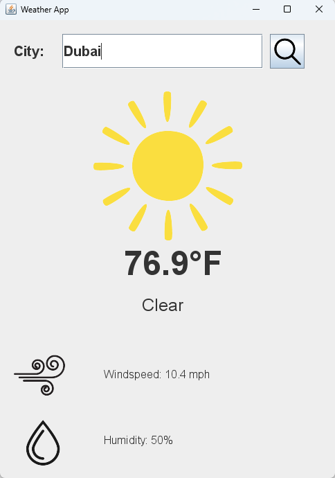

# 🌤 Real-Time Weather App  

### 📌 Description  
This Java Swing application fetches and displays real-time weather data using the **OpenWeatherMap.org API**. The program makes HTTP requests to retrieve weather information in **JSON format**, parses the response, and presents key details such as **temperature, humidity, wind speed, and weather conditions** in a user-friendly GUI. The project follows an **object-oriented design** for scalability and efficiency.  

### 🔍 How It Works  
1. The user enters a city name in the input field.  
2. The app constructs an **HTTP GET request** to the OpenWeatherMap API with the city name and API key.  
3. The API returns a **JSON response** containing weather data, including temperature, humidity, pressure, wind speed, and conditions.  
4. The app parses the JSON response and extracts relevant information using a JSON library.  
5. The processed data is displayed in a structured format within the Java Swing GUI.  

### 🛠 Technologies Used  
- **Java Swing** – For graphical user interface design  
- **OpenWeatherMap API** – For retrieving real-time weather data  
- **JSON Parsing (org.json or Gson)** – To process API responses  
- **HTTP Requests (HttpURLConnection)** – To communicate with the API  

### 🔧 Object-Oriented Design  
- **WeatherFetcher.java** – Handles API requests and JSON parsing  
- **WeatherGUI.java** – Builds the Swing interface and displays data  
- **WeatherApp.java** – Main entry point, integrates all components  

### Example

